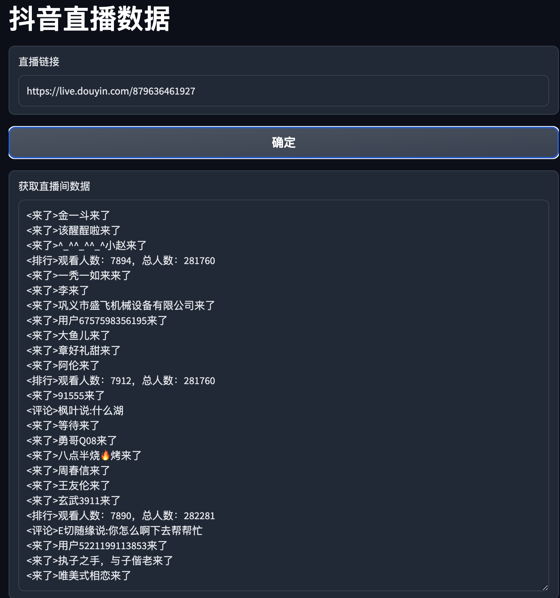

抖音算法 | [Tiktok Algorithm](README_tt.md)


# x-ladon, x-argus, x-gorgon, x-khronos, 设备注册
抖音、Tiktok算法，x-argus, x-ladon, x-gorgon, x-khronos算法，设备注册算法  


## 抖音算法

### 设备注册算法


```json
{
  "device_id": "3109861000223965",
  "iid": "101597186886039"
}
```

### x-gorgon x-kronos 算法


```json
{
  "x-gorgon":"0404d0e40001399639b51704a5760372721ccf34c432f6c46b04",
  "x-khronos":"1668220955"
}
```

### x-argus x-ladon 算法


```json
{
  "x-gorgon": "040420d20000021445bcfe5add2bofbc146cddeec93d4C7Tee16",
  "x-khronos":"1668220980", 
  "x-ladon": "FCZIXGQS3bZV2RS4FSQvKOZGVf5MWQTognqLavIU+U8SxFzy",
  "x-argus": "/IHPTDpxbRwDIQpzNmuHQkP511j9c/LiGfvc12VsOojpgRbPcwaC10oVU5U3kWNWSiGePsc8TcY×Q4NqoAb5T6+|fi5AFhSEptuRTk2bzm8p79n2wMnSUwkIHH5spFaKmHXm38bXWSMgYGEG6Xh|4/8tRZNtQU2kX5vbFR9ujAQH244IbM8TNy5|gvmZqdY9IT4 ngrsNi3vfvy9lcdo2n8TYiRxE9tWIwwKTWV7Utgcu7bWRmkylhozbNkCNrDiT40="
}
```

### live data


```
<来了>金一斗来了
<来了>该醒酲啦来了
<来了>^_^^_^^_^小赵来了
<排行>观看人数：7894，总人数：281760
<来了>一秃一如来来了
<来了>李来了
<来了>巩义市盛飞机械设备有限公司来了
<来了>用户6757598356195来了
<来了>大鱼儿来了
<来了>章好礼甜来了
<来了>阿伦来了
<排行>观看人数：7912，总人数：281760
<来了>91555来了
<评论>枫叶说:什么湖
<来了>等待来了
<来了>勇哥Q08来了
<来了>八点半烧🔥烤来了
<来了>周春信来了
<来了>王友伦来了
<来了>玄武3911来了
<排行>观看人数：7890，总人数：282281
<评论>E切随缘说:你怎么啊下去帮帮忙
<来了>用户5221199113853来了
<来了>执子之手，与子偕老来了
<来了>唯美式相恋来了
```

#### 用户详情测试


# [联系交流](https://t.me/xgxkxaxl)